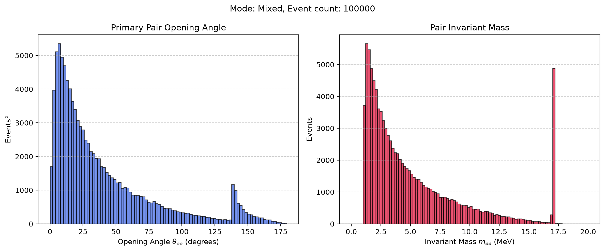

# X17 detector study

## Setup and run

```sh
mamba env create -f environment.yml
mamba activate x17-detector-study
python scripts/generate_geometry.py
cmake -S . -B build -DCMAKE_PREFIX_PATH="$CONDA_PREFIX"
cmake --build build -j
./build/simulate_detection
```

Edit `config/configuration.toml` to set the source, run mode, and output file before running. Run commands from the repository root.

## Detector

[View the detector gallery](docs/index.html): seven views of the scintillators,
chamber, ΔE detectors and target assembly. Site assets live in `docs/site/`.

## Results

The truth plot below predates the geometry update.


