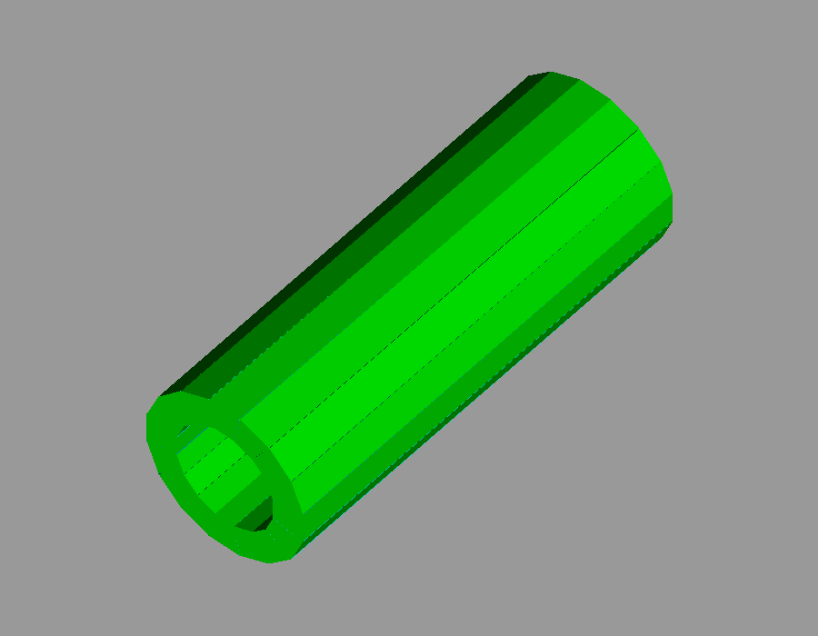
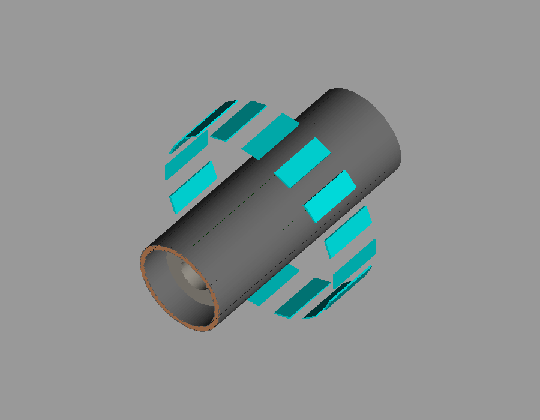

# X17 detector study

## Setup and run

```sh
mamba env create -f environment.yml
mamba activate x17-detector-study
python scripts/generate_geometry.py
cmake -S . -B build -DCMAKE_PREFIX_PATH="$CONDA_PREFIX"
cmake --build build -j
./build/simulate_detection
```

Edit `config/configuration.toml` to set the source, run mode, and output file before running. Run commands from the repository root.

## Detector

[Open the side-by-side reference comparison](docs/figures/reference_comparison/index.html)
for seven views of both implementations, including ΔE housings, cavities,
scintillators, wrapping and the target supports. Colors match the lead team's code.





## Results

The truth plot below predates the geometry update.


